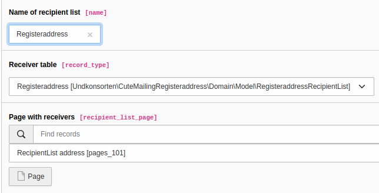

# typo3-cute-mailing-registeraddress

This extension adds [registeraddress](https://github.com/undkonsorten/registeraddress) as recipient list to [typo3-cute-mailing](https://github.com/undkonsorten/typo3-cute-mailing)

